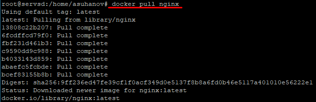
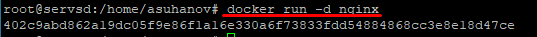
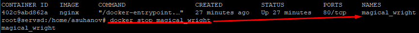
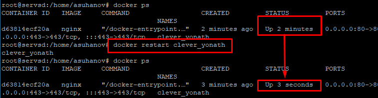
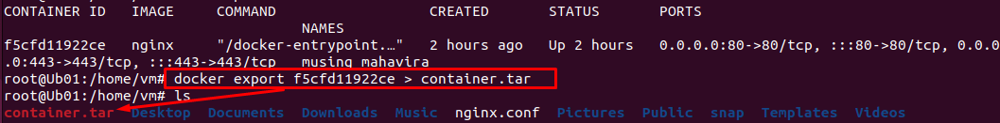

# Part 1. Ready-made docker  
- `apt install docker.io`  
## Take the official docker image from nginx and download it using docker pull.   
- `docker pull nginx`  
  
`The image has been downloaded and assembled on our server.`  
## Check for the docker image with docker images.  
- `docker images`    
  
`To check the images that are already installed and available on our server, use the command: docker images`  
    - REPOSITORY - the repository from where our image is downloaded and assembled. In this case, the official image taken from hub.docker.com/_/nginx.  
    - TAG is the version of our nginx. We have the latest version of the image.  
    - IMAGE ID - The ID of our image.  
    - CREATED - the date when this image was assembled and uploaded to the repository.  
    - SIZE - the size of the image.  
## Run docker image with docker run -d [image_id|repository].  
- `docker run -d nginx`  
`The -d flag in the docker run command is used to run the container as a separate process.`  
  
## Check that the image is running with docker ps.  
- `docker ps`  
  
    - CONTAINER ID - The ID of our container. 
    - IMAGE - the name of our image. 
    - COMMAND is an instruction that is executed when the Docker container is launched. In this instruction, we can put all those commands that need to be run every time the container is restarted. In order not to do these actions manually. 
    - CREATED - the date when we assembled our container. 
    - STATUS - the current status of the container. 
    - PORTS - ports that are open in the container and to which it accepts a connection. 
    - NAMES is the name of our container.
## View container information with docker inspect [container_id|container_name].  
- `docker inspect 402c9abd862a`  
`Docker inspect is a tool in the Docker ecosystem that provides detailed information about Docker containers and images.`  
  
## From the command output define and write in the report the container size, list of mapped ports and container ip.  
  
## Stop docker image with docker stop [container_id|container_name].  
- `docker stop magical_wright`  
  
## Check that the image has stopped with docker ps.  
  
## Run docker with ports 80 and 443 in container, mapped to the same ports on the local machine, with run command.  
- `docker run -d -p 80:80 -p 443:443 nginx`  
  
## Проверь, что в браузере по адресу localhost:80 доступна стартовая страница nginx.  
  
## Перезапусти докер контейнер через docker restart [container_id|container_name].  
- `docker restart clever_yonath`  
  
## Проверь любым способом, что контейнер запустился.  
  

## Part 2. Operations with container  
## Read the *nginx.conf* configuration file inside the docker container with the *exec* command.  
- `docker exec [OPTIONS] CONTAINER COMMAND [ARG..]` -> `docker exec [CONTAINER] cat [FILE_PATH]`  
  
## Create a *nginx.conf* file on a local machine.  
- `touch nginx.conf` -> copy settings nginx.conf   
## Configure it on the */status* path to return the **nginx** server status page.  
  
## Copy the created *nginx.conf* file inside the docker image using the `docker cp` command.  
- `docker cp [OPTIONS] SRC_PATH|- CONTAINER:DEST_PATH` -> `docker cp [SRC_PATH] [CONTAINER:DEST_PATH]` -> `docker cp nginx.conf f5cfd11922ce:/etc/nginx/`  
  
## Restart **nginx** inside the docker image with *exec*.  
- `docker exec f5cfd11922ce nginx -s reload`  
  
## Check that *localhost:80/status* returns the **nginx** server status page.  
- open browser or `curl localhost:80/status`  
  
## Export the container to a *container.tar* file with the *export* command.  
- `docker export f5cfd11922ce > container.tar`  
  
## Stop the container.   
- `docker stop f5cfd11922ce`  
  
## Delete the image with `docker rmi [image_id|repository]`without removing the container first.  
- `docker rmi --force 2ac752d7aeb1`  
  
`When deleting a docker image, it returns an error because the container still exists. When using the -f or --force flag, a forced deletion occurs`  
## Delete stopped container.  
- `docker rm [CONTAINER]`  
  
## Import the container back using the *import*command.  
- `docker import [archive_name] [Image_name]` -> `docker import -c 'CMD ["nginx", "-g", "daemon off;"]' container.tar ngld`  
  
## Run the imported container.  
- `docker run -d -p 80:80 -p 443:443 ngld`  
  
## Check that *localhost:80/status* returns the **nginx** server status page.  
  
  
# Part 3. Mini web server  
- To complete subsequent tasks, you will need an installed FCGI library `apt install gcc spawn-fcgi libfcgi-dev`  
- Launched the container through 81 ports `docker run -d -p 81:81 ngld`  
## Write a mini server in **C** and **FastCgi** that will return a simple page saying `Hello World!`.  
  
## Run the written mini server via *spawn-fcgi* on port 8080.  
- Copy write mini-server in container. `docker cp hwrld_fcgi.c 758ff04bb678:/home`  
- Go to container `docker exec -it 758ff04bb678 bash`
  
- `apt install gcc spawn-fcgi libfcgi-dev`  
- `gcc -o server_fcgi hwrld_fcgi.c -lfcgi`  
- `spawn-fcgi -p 8080 ./server_fcgi`  
  
## Write your own *nginx.conf* that will proxy all requests from port 81 to *127.0.0.1:8080*.  
  
  
- `docker exec 758ff04bb678 nginx -s reload`  
## Check that browser on *localhost:81* returns the page you wrote.  

## Put the *nginx.conf* file under *./nginx/nginx.conf* (you will need this later).  
  

# Part 4. Your own docker  
## Write your own docker image that:  
### 1) builds mini server sources on FastCgi from [Part 3](#part-3-mini-web-server);  
### 2) runs it on port 8080;  
### 3) copies inside the image written *./nginx/nginx.conf*;  
### 4) runs **nginx**.  
  
## Build the written docker image with `docker build`, specifying the name and tag.  
- `docker build -t my_docker .` -> my_docker:latest  
## Check with `docker images` that everything is built correctly.  
  
## Run the built docker image by mapping port 81 to 80 on the local machine and mapping the *./nginx* folder inside the container to the address where the **nginx** configuration files are located (see [Part 2](#part-2-operations-with-container)).  
- `docker run -d -p 80:81 -v /home/vm/part4/nginx/nginx.conf:/etc/nginx/nginx.conf --name server_container my_docker`  
  
## Check that the page of the written mini server is available on localhost:80.  
  
## Add proxying of */status* page in *./nginx/nginx.conf* to return the **nginx** server status.  
  
## Restart docker image.  
- `docker restart server_container`  
  
## Check that *localhost:80/status* now returns a page with **nginx** status.  
  

# Part 5. **Dockle**  
## Check the image from the previous task with `dockle [image_id|repository]`.  
## Fix the image so that there are no errors or warnings when checking with **dockle**.  
  

