# Part 1. Готовый докер  
- `apt install docker.io`  
## Возьми официальный докер-образ с nginx и выкачай его при помощи docker pull.  
- `docker pull nginx`  
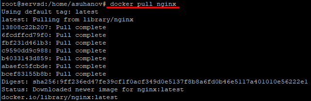  
`Образ скачан и собран на нашем сервере.`  
## Проверь наличие докер-образа через docker images.  
- `docker images`  
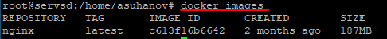  
`Для проверки образов, которые уже установлены и имеются на нашем сервере, используется команда: docker images`  
    - REPOSITORY - репозиторий, откуда загружен и собран наш образ. В данном случае официальный образ взятый с hub.docker.com/_/nginx.  
    - TAG - версия нашего nginx. У нас самая последняя версия образа.  
    - IMAGE ID - ID нашего образа.  
    - CREATED - дата, когда был собран данный образ и выложен в репозиторий.  
    - SIZE - размер образа.  
## Запусти докер-образ через docker run -d [image_id|repository].  
- `docker run -d nginx`  
`Флаг -d в команде docker run используется для запуска контейнера в качестве отдельного процесса.`  
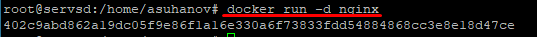  
## Проверь, что образ запустился через docker ps.  
- `docker ps`  
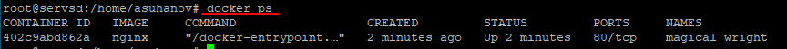  
    - CONTAINER ID - ID нашего контейнера.  
    - IMAGE - название нашего изображения.  
    - COMMAND - это инструкция которая выполняется при запуске контейнера Docker. В данную инструкцию мы можем поместить все те команды, которые необходимы запускать каждый раз при перезагрузке контейнера. Чтоб не делать данные действия вручную.  
    - CREATED - дата, когда мы собрали наш контейнер.  
    - STATUS - текущий статус контейнера.  
    - PORTS - порты которые открыты в контейнере и на которые он принимает соединение.  
    - NAMES - название нашего контейнера.  
## Посмотри информацию о контейнере через docker inspect [container_id|container_name].  
- `docker inspect 402c9abd862a`  
`Docker inspect — это инструмент в экосистеме Docker, который предоставляет детальную информацию о контейнерах и образах Docker.`  
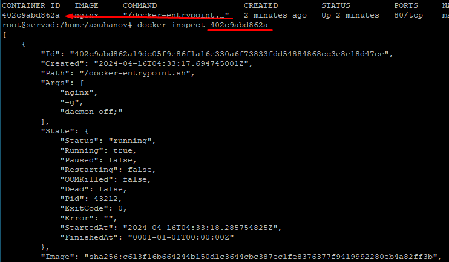  
## По выводу команды определи и помести в отчёт размер контейнера, список замапленных портов и ip контейнера.  
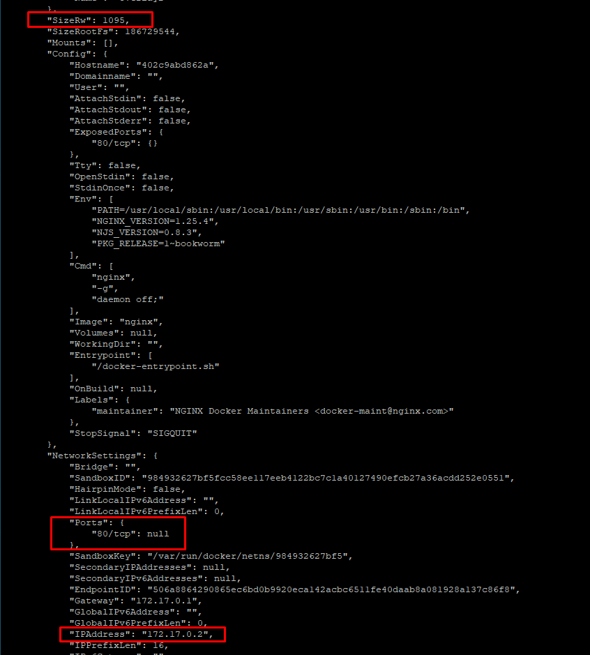  
## Останови докер образ через docker stop [container_id|container_name].  
- `docker stop magical_wright`  
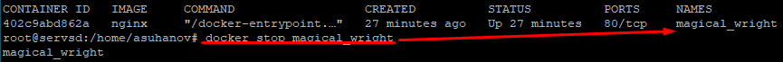  
## Проверь, что образ остановился через docker ps.  
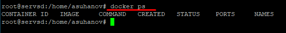  
## Запусти докер с портами 80 и 443 в контейнере, замапленными на такие же порты на локальной машине, через команду run.  
- `docker run -d -p 80:80 -p 443:443 nginx`  
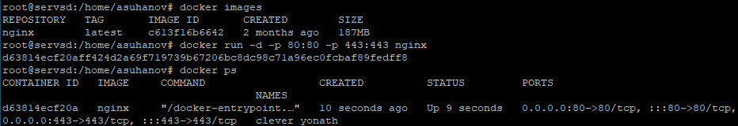  
## Check that the nginx start page is available in the browser at localhost:80.  
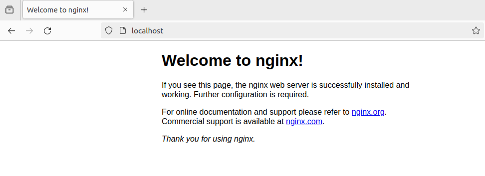  
## Restart docker container with docker restart [container_id|container_name].  
- `docker restart clever_yonath`  
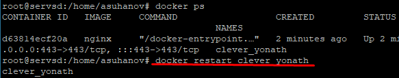  
## Check in any way that the container is running.  
  

# Part 2. Операции с контейнером  
## Прочитай конфигурационный файл *nginx.conf* внутри докер контейнера через команду *exec*.  
- `docker exec [OPTIONS] CONTAINER COMMAND [ARG..]` -> `docker exec [CONTAINER] cat [FILE_PATH]` -> `docker exec musing_mahavira cat /etc/nginx/nginx.conf`  
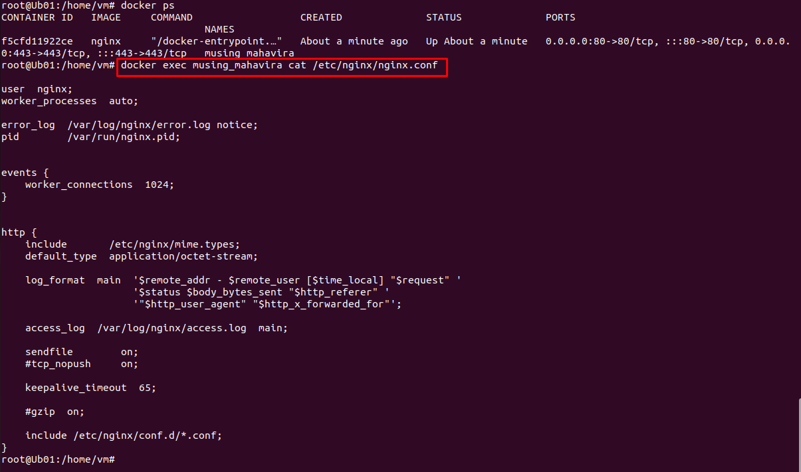  
## Создай на локальной машине файл *nginx.conf*.  
- `touch nginx.conf` -> скопировал настройки из conf докера  
## Настрой в нем по пути */status* отдачу страницы статуса сервера **nginx**.  
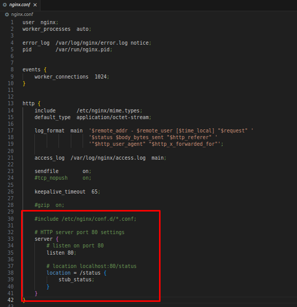  
## Скопируй созданный файл *nginx.conf* внутрь докер-образа через команду `docker cp`.  
- `docker cp [OPTIONS] SRC_PATH|- CONTAINER:DEST_PATH` -> `docker cp [SRC_PATH] [CONTAINER:DEST_PATH]` -> `docker cp nginx.conf f5cfd11922ce:/etc/nginx/`  
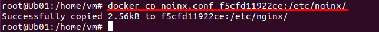  
## Перезапусти **nginx** внутри докер-образа через команду *exec*.  
- `docker exec f5cfd11922ce nginx -s reload`  
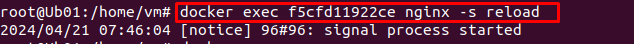  
## Проверь, что по адресу *localhost:80/status* отдается страничка со статусом сервера **nginx**.  
- open browser or `curl localhost:80/status`  
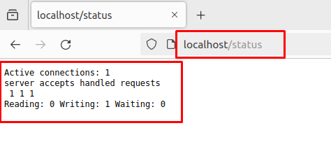  
## Экспортируй контейнер в файл *container.tar* через команду *export*.  
- `docker export f5cfd11922ce > container.tar`  
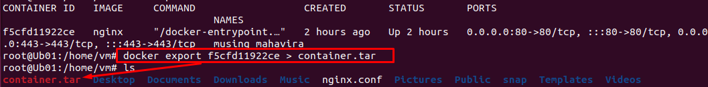  
## Останови контейнер.  
- `docker stop f5cfd11922ce`  
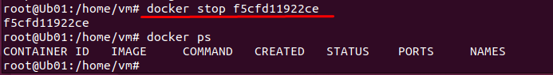  
## Удали образ через `docker rmi [image_id|repository]`, не удаляя перед этим контейнеры.  
- `docker rmi --force 2ac752d7aeb1`  
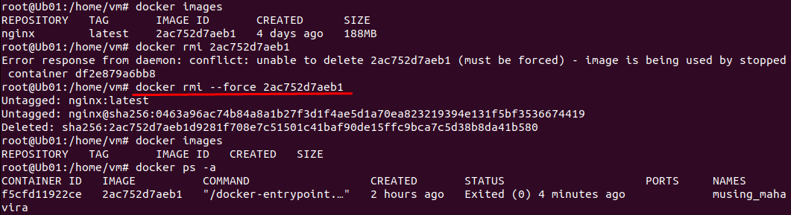  
`При удалении docker-образа выдает ошибку, так как контейнер все еще существует. При использовании флага -f или --force происходит принудительное удаление`  
## Удали остановленный контейнер.  
- `docker rm [CONTAINER]`  
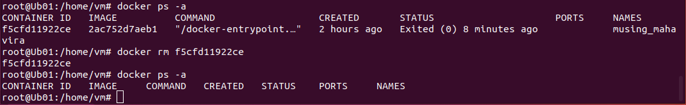  
## Импортируй контейнер обратно через команду *import*.  
- `docker import [archive_name] [Image_name]` -> `docker import -c 'CMD ["nginx", "-g", "daemon off;"]' container.tar ngld`  
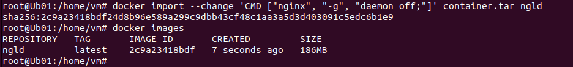  
## Запусти импортированный контейнер.  
- `docker run -d -p 80:80 -p 443:443 ngld`  
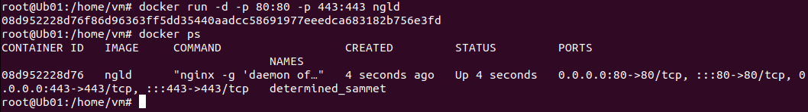  
## Проверь, что по адресу *localhost:80/status* отдается страничка со статусом сервера **nginx**.  
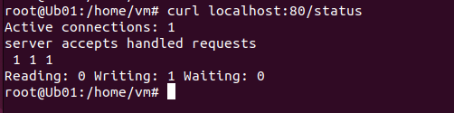  

# Part 3. Мини веб-сервер  
- Для выполнения последующих заданий потребуется установленная FCGI либа `apt install gcc spawn-fcgi libfcgi-dev`  
- Запустил контейнер через 81 порт `docker run -d -p 81:81 ngld`  
## Напиши мини-сервер на **C** и **FastCgi**, который будет возвращать простейшую страничку с надписью `Hello World!`.  
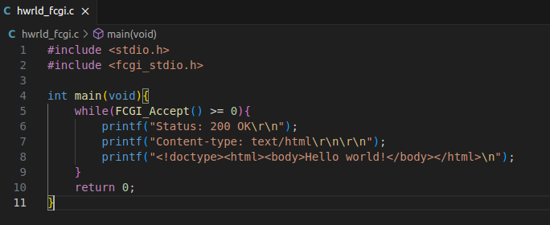  
## Запусти написанный мини-сервер через *spawn-fcgi* на порту 8080.  
- Написанный мини-сервер скопируем в контейнер. `docker cp hwrld_fcgi.c 758ff04bb678:/home`  
- Зайдем в контейнер `docker exec -it 758ff04bb678 bash`
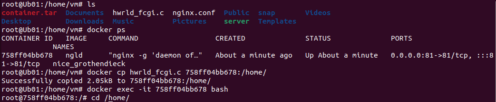  
- `apt install gcc spawn-fcgi libfcgi-dev`  
- `gcc -o server_fcgi hwrld_fcgi.c -lfcgi`  
- `spawn-fcgi -p 8080 ./server_fcgi`  
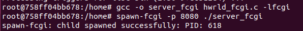  
## Напиши свой *nginx.conf*, который будет проксировать все запросы с 81 порта на *127.0.0.1:8080*.  
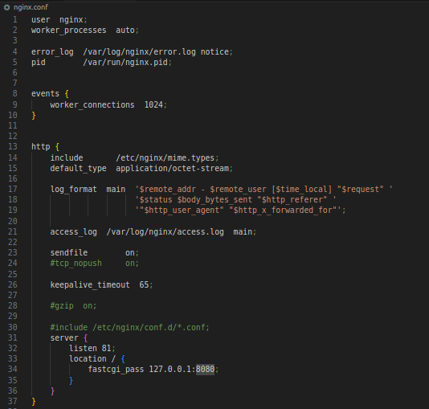  
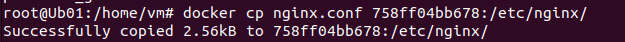  
- `docker exec 758ff04bb678 nginx -s reload`  
## Проверь, что в браузере по *localhost:81* отдается написанная тобой страничка.  
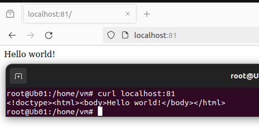
## Положи файл *nginx.conf* по пути *./nginx/nginx.conf* (это понадобится позже).  
  
